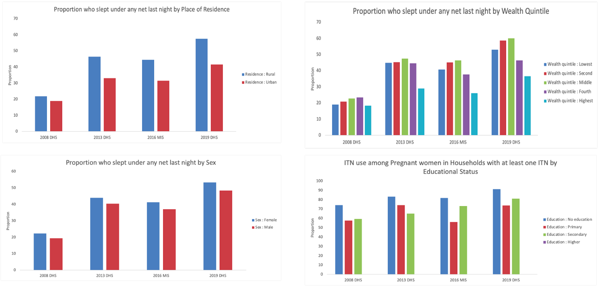
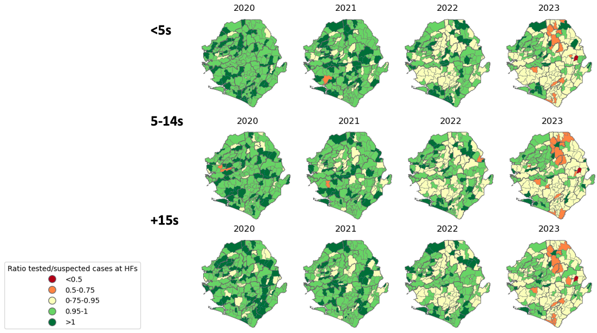

Epidemiological stratification and subnational targeting (SNT) of malaria control interventions in Sierra Leone  

 

July 2024

Summary

Malaria continues to pose a significant public health challenge in Sierra Leone, with its burden varying across time and geographical regions. Given the constraints on human and financial resources, a strategic approach based on disease transmission intensity is essential. This stratification allows for targeted interventions tailored to the epidemiological profile of each chiefdom, taking into account insecticide resistance patterns, parasite sensitivity to treatments, and vector biology. The ultimate goal is to maximize cost-effectiveness in malaria control efforts.

Epidemiological stratification can be achieved through various methodologies, utilizing different data sources either independently or in combination. A spectrum of indicators, including both crude and predicted prevalence, as well as crude, WHO-adjusted, or predicted incidence rates, can be employed for this purpose. The selection of the most suitable approach is context-dependent, considering factors such as the surveillance system's capacity to capture comprehensive malaria case data, healthcare-seeking behaviors among febrile patients, and the overall quality of malaria-related data within the country.

This report presents a comprehensive analysis of routine data collected over the past nine years in Sierra Leone, complemented by the most recent malaria prevalence data from the 2021 Malaria Indicator Survey. Its primary objective is to guide the national malaria control program and other stakeholders in identifying the most relevant indicators for the local context. To facilitate informed decision-making, we present prevalence and incidence maps along with adjusted values for each indicator. Additionally, we outline the targeting of various malaria control interventions, based on WHO recommendations and stakeholder consensus. 

It's important to note that this document contains preliminary analysis results. These findings will be subject to updates as new data becomes available and will incorporate insights from ongoing stakeholder discussions and workshops.

Acknowledgments

We would like to thank all our partners who have contributed to the development of this document and the revision of its various versions.

Contacts:

NMCP: 

Mr Musa Sillah-Kanu (NMCP-M&E unit, musasillahkanu1@gmail.com)

Dr Mac-Abdul Falama (NMCP-PM, abdulmac14@yahoo.com)

CHAI: 

Mr Victor Olayemi (volayemi@clintonhealthaccess.org)

Dr Valérian Turbé (vturbe@clintonhealthaccess.org)

Dr Celestin Danwang (cdanwang@clintonhealthaccess.org)

WHO: 

Mr Mohamed Sillah Kanu (sillahmohamedkanu@gmail.com)

Dr Omoniwa Omowunmi Fiona (omoniwao@who.int)

Dr Beatriz Galatas (galatasb@who.int)

NB: This document, which is a preliminary version of the analysis results for stratification and targeting of malaria control interventions, includes the results obtained to date (August 11, 2024). This document is intended to be modified according to the amendments made by the various stakeholders and should in no way be considered as the final and official version of the Sierra Leone 2024 SNT report.

Table of contents

List of figures

Figure 1. SNT team members	6

Figure 2. Inconsistencies checking	7

Figure 3. Strip plot of intervention variables for malaria in Sierra Leone (2015-2023)	8

Figure 4. stacked bar charts for the number of outliers for test positivity per month in Sierra Leone (2015-2023)	9

Figure 5. Overall reporting status among DHIS2 HFs in Sierra Leone (2015-2023)	10

Figure 6. Reporting rate of confirmed cases among DHIS2 HFs in Sierra Leone (2015-2023)	11

Figure 7. Crude incidence of malaria (cases per 1000 inhabitants)	12

Figure 8. Malaria incidence adjusted for testing	13

Figure 9. Malaria incidence adjusted for testing and reporting rate	14

Figure 10. Malaria incidence adjusted for testing, reporting and care seeking rate	15

Figure 11. Summary of crude and adjusted incidence values according to WHO methodology	16

Figure 12. Care-seeking rate in Sierra Leone	17

Figure 13. Prevalence of Plasmodium falciparum (SLMIS 2021)	18

Figure 14. Under-five mortality rate, all causes from SLDHS 2019	18

Figure 15. Median Incidence 2019-2023 adjusted for testing and reporting rates	19

Figure 16. final maps for risk estimation	19

Figure 17. Map for access to care decision-making	20

Figure 18. CHW density	20

Figure 19. CHW and access	21

Figure 20. Care-seeking behavior	21

Figure 21. Health facilities density per population	22

Figure 22. Testing rate (DHS 2019)	22

Figure 23. Testing rates for uncomplicated malaria in health facilities	22

Figure 24. Treatment rates for uncomplicated malaria in health facilities	23

Figure 25. Presumed cases	23

Figure 26. CHWs malaria testing rates	24

Figure 27. CHW malaria treatment rates	24

Figure 28. Hospital malaria mortality ratios	25

Figure 29. RDT stockouts per year	25

Figure 30. Antimalarial stock outs	26

Figure 31. ACT stock-outs	26

Figure 32. Coverage of ITN distribution through antenatal care visits	27

Figure 33. Coverage of mass ITN distribution	27

Figure 34. targeting of school-based ITN distribution (SBD)	28

Figure 35. Household ITN access (map)	28

Figure 36. Household ITN access (plot)	29

Figure 37. Population ITN use	29

Figure 38. Pregnant women ITN use	30

Figure 39. Population-level ITN use	30

Figure 40. Net durability	31

Figure 41. IRS implementation and coverage	32

Figure 42. IPTp operational coverage out of ANC1	32

Figure 43. IPTp effective coverage (DHS 2019)	32

Figure 44. IPTi (PMC) Coverage out of target population	33

Figure 45. chiefdoms where malaria vaccination is conducted	33

Figure 46. Location of entomological surveillance sites	34

Figure 47. Rainfall vs cases (all ages and u5) for seasonality analysis	34

Figure 48. Profiling seasonality for SMC targeting	35

Figure 49. Seasonality map based on rainfall vs case peaks	35

Figure 50. Rainfall peak detection (example of BO)	36

Figure 51. The onset of end and peak of the rainy season	36

Figure 52. Seasonality for implementation purposes using cases	37

 

Introduction

Sierra Leone, with a population of 8,529,615 in 2022 accounts for 1.1% of global malaria cases and 1.3% of malaria deaths worldwide.[1] To reduce the burden of malaria, one of the pillars set by WHO is the use of strategic information for response and decision-making. In line with this approach, a stratification at the chiefdom level has been carried out in Sierra Leone, taking into account the malaria burden and additional contextual factors. The aim of this stratification is to ensure the implementation of appropriate, context-specific interventions to maximize impact. This report summarizes the methods, analysis, and results of this stratification, carried out with technical support from partners including CHAI and WHO-GMP. The analysis process comprises three main stages: chiefdoms are stratified based on major epidemiological data (Plasmodium prevalence, malaria incidence, and all-cause mortality in children under five), as well as factors such as entomological elements, insecticide resistance, seasonality, urbanization, and access to care. Different layers of stratified information are then combined to target interventions in each chiefdom. Finally, the impact of different scenarios considered during the intervention targeting process is assessed using mathematical modeling to inform prioritization and decision-making. 

The stratification and subnational tailoring of intervention (SNT) process was performed transparently, using an inclusive approach where all partners deemed relevant by the NMCP participated in weekly meetings coordinated by WHO (Figure 1).

Figure . SNT team members

Epidemiological stratification

The data used in this analysis come from the District Health Information System version 2 (DHIS2), the 2019 Sierra Leone Demographic and Health Survey (SLDHS),[2] 2021 Sierra Leone Malaria Indicators Survey (SLMIS 2021) and results of studies carried out by partners in Sierra Leone. All these data were consolidated into a single database available in the WHO SharePoint. Data processing and analysis were carried out using python, Stata and R analysis software, with codes available upon request.

The first step was to merge the data into a single database and shapefile in python. For this purpose, the names of the geographical units (admin1, admin2 and admin3) contained in DHIS2 were taken as the reference. The names of the geographical units contained in the various data files were modified to match those in DHIS2. Subsequently, variable names were standardized to match the data dictionary used by WHO-GMP for variable names in SNT. The dictionary employed is available in the WHO SharePoint and can be obtained upon request. The resulting data was then merged with the adm3 level Shapefile (chiefdoms/zones). Analyses were carried out at the chiefdom level in accordance with the resolutions of the initial stratification online meeting.

Sierra Leone has made steady progress in malaria control over the past decade, with malaria prevalence among children under five decreasing slightly from 40.1% in 2016 (MIS 2016) to 21.6% in 2021 (SL MIS 2021). However, the country still faces significant challenges, including high transmission rates in certain districts, insecticide resistance, and the need for improved healthcare access in rural areas. This stratification effort aims to address these challenges by tailoring interventions to the specific needs of each chiefdom/district ultimately contributing to Sierra Leone's goal of reducing malaria morbidity and mortality. By adopting a more targeted approach, the country seeks to optimize its resources and enhance the effectiveness of its malaria control strategies, paving the way for further reductions in the disease burden across the country.

Quality assessment of data elements used for stratification

Checking database contents

The variables of interest for epidemiological stratification are listed in the SNT data collection template available to all on the WHO Sharepoint. This template summarizes in an excel file, the routine and intervention data collected between 2015 and 2023, disaggregated by month and by chiefdom.

Inconsistencies

To detect the presence of inconsistencies in the data, nested data elements were used. Figure 2 illustrates comparisons between different malaria-related indicators.

Figure . Inconsistencies checking

Some key observations:

test vs allout (top left): This graph compares the number of malaria tests performed (test) with the total number of outpatients (allout). Ideally, all points should fall below the diagonal line, as the number of tests should not exceed the total number of outpatients. However, we observed many points above the line, indicating instances where more malaria tests were reported than total outpatients. This suggests potential over-reporting of malaria tests or under-reporting of outpatient visits.

conf vs test (top right): This graph compares the number of confirmed malaria cases (conf) with the number of tests performed (test). All points should fall below the diagonal line, as confirmed cases cannot exceed the number of tests. The graph shows good consistency, with most points below the line, indicating that this relationship is generally well-maintained in the data.

maltreat vs conf (bottom left): This graph compares the number of malaria treatments given (maltreat) with the number of confirmed cases (conf). Ideally, these numbers should be close, with points near the diagonal line. However, we see many points below the line, suggesting that in some instances, fewer treatments were given than there were confirmed cases. This could indicate issues with treatment availability or reporting inconsistencies.

maldth vs maladm (bottom right): This graph compares malaria deaths (maldth) with malaria admissions (maladm). All points should fall below the diagonal line, as deaths cannot exceed admissions. The graph shows good consistency in this regard, with all visible points below the line. However, the clustering of points near zero suggests that either malaria mortality is very low or there might be under-reporting of malaria deaths.

These graphs highlight several data quality issues: i) Inconsistencies between malaria tests and outpatient numbers, ii) Generally good consistency between confirmed cases and tests, iii) Potential under-treatment or under-reporting of treatments for confirmed cases, iv) Consistent relationship between malaria deaths and admissions, but possible under-reporting of deaths (Figure 2).

These findings underscore the need for improved data quality assurance measures, regular monitoring of reported data, and capacity building for health workers in accurate data collection and reporting. Further investigation is needed to understand the root causes of these inconsistencies, which could include issues with data entry, misunderstanding of reporting requirements, stockout of registers and reporting tools, or systemic problems in the health information system.

Outliers

To visualize and analyze outliers across variables and years from 2015 to 2023, strip plots were constructed for both routine epidemiological data (Figure 3) and intervention data (Figure 3) related to malaria in Sierra Leone.

This visualization (Figure 3) allows for a comparison of different malaria interventions over time in Sierra Leone, highlighting variations, potential trends, and unusual data points that may warrant further investigation.

Figure . Strip plot of intervention variables for malaria in Sierra Leone (2015-2023)

Some key observations:

Outliers: There are several notable outliers, particularly for variables like "IPTi3 total", "LLIN_penta3 total", where some data points are significantly higher than the majority.

Variability: Some variables show more spread in their values across years (e.g., "Vita1 total", " Vita2 total "), while others are more tightly clustered (e.g., "Penta1 total", " Penta3 total ").

Temporal trends: For some variables, there appear to be changes over time. For example, "anc4 total" seems to have more high-value outliers in later years.

Missing data: Some variables have fewer data points than others, which could indicate missing data for certain years.

Consistency: Some interventions (like those at the bottom of the graph) seem to have more consistent values across years, while others (like those in the middle) show more variation.

The outlier checking of routine epidemiological malaria data in Sierra Leone was done (Figure 4). Outlier detection is crucial in this context because: outliers can lead to the misclassification of chiefdoms due to incorrect data. Thus, the detection process was automated for each health facility (HF), identifying records above [Q3 + 1.5*IQR] based on the data distribution for each facility. Due to Community Health Worker (CHW) outreach campaigns in 2023 that affected the data, this year was excluded from outlier detection, and its values were not corrected. Similar, 2023 was also excluded from the distribution used to compute the thresholds for each health facility.

Figure 4. stacked bar charts for the number of outliers for test positivity per month in Sierra Leone (2015-2023)

Some key observations in figure 4:

Fluctuations: The graph shows significant fluctuations in test positivity rates over time, with some periods showing higher rates than others.

Seasonal patterns: There appear to be some recurring patterns, possibly indicating seasonal variations in malaria transmission or testing rates.

Outliers: While specific outliers are not immediately apparent in this aggregated view, there are several spikes in the data that could represent periods of unusually high-test positivity rates. These could be due to actual increases in malaria cases or potential data anomalies.

Recent trends: The right side of the graph, representing more recent years, shows some notably high spikes in test positivity rates across multiple categories.

Potential impact of interventions: Some of the variations observed could be related to malaria control interventions or changes in testing practices over time.

This visualization provides a comprehensive view of test positivity trends over time, allowing for the identification of patterns, potential outliers, and areas that may require further investigation or data validation.

Reporting rate 

To calculate the malaria reporting rate, health facility level routine data were obtained from Sierra Leone's national DHIS2 system for the period 2015 to 2023 (Figure 5).

Figure 5. Overall reporting status among DHIS2 HFs in Sierra Leone (2015-2023)

The graph above (Figure 5) presents a comprehensive visualization of health facility reporting patterns across districts in Sierra Leone from 2015 to 2023. This graph tracks the monthly reporting of key malaria indicators including all-cause outpatients, tested, confirmed, or treated malaria cases. The color-coded representation provides insights into reporting consistency: green indicates months with reports, yellow shows gaps after previous reporting, and red highlights missing data without prior reporting. This visualization was instrumental in computing monthly reporting rates, which were subsequently used to adjust malaria incidence estimates according to WHO methodology.

The graph reveals significant variations in reporting patterns across districts. While some districts demonstrate consistent reporting (predominantly green), others show more frequent gaps (more yellow and red), indicating potential challenges in data collection or submission processes.

This analysis of reporting patterns is crucial for several reasons: It helps identify districts that may require additional support to improve their reporting practices (like Western area urban districts); it provides context for interpreting malaria incidence data, as areas with lower reporting rates may underestimate the true disease burden; it informs the adjustment of incidence rates, ensuring more accurate estimates of malaria burden across Sierra Leone.

After discussion, it was agreed that only health facilities which had previously reported data (all-cause outpatients, tested, confirmed, or treated) at least once would be considered active and included in the denominator when calculating the reporting rate. 

Figure 6 illustrates the monthly reporting rate by health facility and district of confirmed cases, which is the main variable used to calculate crude incidence.

Figure 6. Reporting rate of confirmed cases among DHIS2 HFs in Sierra Leone (2015-2023)

The heatmap in Figure 6 reveals significant variations in confirmed malaria case reporting rates across districts and over time, with most districts showing improved consistency in recent years, though some continue to exhibit periodic gaps or fluctuations in reporting, underscoring the importance of ongoing efforts to strengthen the health information system and ensure comprehensive malaria surveillance across Sierra Leone.

Incidence of malaria 

To calculate malaria incidence, routine data aggregated by chiefdom were obtained from Sierra Leone's national DHIS2 system for the period from 2015 to 2023. The reporting rate obtained as explained in the previous section was used for incidence adjustment.

The total number of confirmed malaria cases was calculated by summing confirmed cases at community, health center, and hospital levels. Crude incidence per month (or year) was obtained by dividing the number of confirmed cases by the Chiefdom's population.

The incidence was adjusted using WHO methodology:[3]

1. First-level adjustment: Accounting for presumed cases not tested.

2. Second-level adjustment: Accounting for variable reporting rates across Chiefdoms.

3. Third-level adjustment: Incorporating care-seeking behavior estimates from community surveys (DHS/MICS) to account for cases outside the public health sector.

Crude and adjusted incidence rates were categorized based on the maximum value of adjusted annual incidence observed in each chiefdom between 2015 and 2023, using the categories: 0-<50, 50-<100, 100-<250, 250-<450, 450-<700, 700-<1000 and >=1000 per 1000 inhabitants at risk.

Crude incidence of malaria (cases per 1000 population at risk)

Crude incidence was obtained by dividing the number of confirmed cases by the population of the chiefdoms. The crude incidence maps for Sierra Leone from 2015 to 2023 reveal a significant and encouraging trend in malaria control efforts across the country. Over this period, there has been a notable decrease in malaria incidence rates, with a marked shift from predominantly high-incidence areas in the earlier years to a more varied landscape with many low to moderate incidence regions by 2023 (Figure 7).

Figure . Crude incidence of malaria (cases per 1000 inhabitants)

The geographical distribution of malaria incidence shows considerable variation across Sierra Leone's chiefdoms. Throughout the years, the southern and eastern regions of the country have consistently exhibited higher incidence rates, while the western and some northern areas have generally maintained lower rates. This pattern suggests that local factors, such as climate, geography, or healthcare access, may play a crucial role in malaria transmission dynamics (Figure 7).

A pivotal change appears to have occurred between 2019 and 2020, with a substantial reduction in high-incidence areas. This shift could be attributed to intensified malaria control efforts, improvements in healthcare infrastructure, or changes in reporting practices. The more recent years (2021-2023) display a more homogeneous distribution of incidence rates, with many chiefdoms falling into the 50-250 per 1000 range, indicating a general stabilization of malaria incidence at lower levels compared to earlier years.

Despite the overall positive trend, some chiefdoms, particularly in the south and southeast, continue to show persistently higher incidence rates across all years. These areas likely require targeted interventions and focused resources to bring them in line with the national trend of decreasing incidence.

The 2023 detailed map provides a clear picture of the current situation, highlighting that while much of the country has achieved relatively low incidence rates, there remain pockets of higher transmission that warrant special attention. 

In conclusion, the crude incidence data from 2015 to 2023 demonstrates significant progress in reducing malaria incidence across Sierra Leone. However, the persistence of some higher-incidence areas underscores the need for continued efforts and targeted strategies (Figure 7).  

Malaria incidence adjusted according to WHO methodology

The WHO incidence adjustment method has been used in several scientific publications.[3–5]  It has the advantage of being relatively easy to implement, and of allowing the correction of limitations linked to the health systems of sub-Saharan African countries (reporting, testing, Healthcare seeking rate).

1.2.2.a. Malaria incidence adjusted for testing

To adjust the number of confirmed cases for the absence of testing in presumed-positive patients, the number of presumed cases was multiplied by the test positivity rate, and the resulting figure was added to the number of cases confirmed by microscopy and/or RDT. The previous result was then divided by the population to obtain the incidence adjusted for the testing rate (1st level of incidence adjustment according to WHO methodology) (Figure 8). 

The series of maps and charts depicting the incidence of malaria adjusted for testing rates in Sierra Leone from 2015 to 2023 reveals a complex and evolving landscape of malaria transmission across the country (Figure 8). The series of maps and accompanying bar graphs illustrate a notable transformation in the incidence patterns over time.

Figure . Malaria incidence adjusted for testing

In the earlier years (2015-2019), the maps depict a highly heterogeneous distribution of malaria incidence across Sierra Leone's chiefdoms. Many areas, particularly in the central and eastern regions, showed high incidence rates, represented by orange and red colorations. The corresponding bar graphs for these years demonstrate a relatively even distribution across incidence categories, with significant representation in the higher brackets (Figure 8).

A marked shift becomes apparent from 2020 onwards. The maps for 2020-2023 display a substantial reduction in high-incidence areas, transitioning towards more moderate (yellow and light blue) and low (blue) incidence rates across numerous chiefdoms. This trend is mirrored in the bar graphs, which show a clear shift towards lower incidence categories, with the majority of chiefdoms falling into the 50-250 per 1000 range by 2023.

The detailed map for 2023 provides a granular view of the current situation. While it confirms the overall trend towards lower incidence rates across much of the country, it also highlights persistent pockets of higher incidence, particularly in the southern region. This nuanced picture underscores the importance of targeted interventions in these remaining high-incidence areas.

1.2.2.b. Malaria incidence adjusted for testing and reporting

The numerator used for the first level of WHO incidence adjustment was divided by the reporting rate. This was done to take into account the variable reporting rates in different chiefdoms, and to obtain a figure close to reality if the reporting rate were 100%. The figure obtained was divided by the population to produce the adjusted incidence for testing and reporting (2nd level of incidence adjustment according to WHO methodology) (Figure 9).

Figure . Malaria incidence adjusted for testing and reporting rate

The visualization in Figure 9 offers a refined perspective on malaria incidence in Sierra Leone from 2015 to 2023, incorporating adjustments for both testing and reporting rates. Examining the chronological progression of maps and their accompanying bar graphs reveals a complex evolution of malaria incidence patterns. The period from 2015 to 2019 is characterized by a heterogeneous distribution of incidence rates across Sierra Leone's chiefdoms. During these initial years, numerous areas, particularly in the central and eastern regions, exhibited elevated incidence rates, visually represented by orange and red hues on the maps. A notable shift in this pattern emerges from 2020 onwards. The maps for the years 2020-2023 illustrate a marked decline in high-incidence areas, with a transition towards more moderate (yellow and light blue) and low (dark blue) incidence rates across a significant number of chiefdoms. This trend is mirrored in the accompanying bar graphs, which depict a clear migration towards lower incidence categories. By 2023, an increasing proportion of chiefdoms fall within the 50-250 per 1000 population range. The detailed map for 2023 provides a granular view of the current malaria situation in Sierra Leone. While it confirms a general trend towards lower incidence rates across much of the country, it also highlights the persistence of higher incidence pockets, particularly in some southern regions.  

 A comparison between the first and second levels of adjustment reveals significant insights into Sierra Leone's malaria landscape. The second-level adjustment, which accounts for both testing and reporting rates, generally indicates higher incidence rates across all years, suggesting a more substantial malaria burden than initially apparent. While both sets of maps demonstrate similar overall trends, the second-level adjustment exposes more areas with higher incidence rates, particularly in earlier years, indicating that underreporting may have obscured the true extent of malaria transmission in certain regions. Although both adjustments show a general decline in incidence over time, the second-level adjustment suggests this decline may be less pronounced than originally thought, with a more evident persistence of higher incidence areas, especially in southern regions. The bar graphs for the second-level adjustment depict a more gradual shift towards lower incidence categories over time, implying a more nuanced progression in malaria control efforts. This refined adjustment, incorporating both testing and reporting rates, offers a more accurate representation of malaria incidence in Sierra Leone, uncovering a higher overall burden and emphasizing the importance of addressing potential underreporting. Such a detailed picture is invaluable for guiding targeted interventions and optimizing resource allocation in the country's ongoing battle against malaria.

1.2.2.c. Malaria incidence adjusted for testing, reporting and healthcare use

Figure 10 illustrates the results of the third level of incidence adjustment according to WHO methodology, which accounts for care-seeking behavior in Sierra Leone from 2015 to 2023. This adjustment, which considers the use of private healthcare facilities and cases where individuals do not seek formal medical care, reveals a more comprehensive picture of malaria incidence across the country.

Assumptions:  i)The routine data available for this analysis is reported only by public health facilities, ii) The care seeking rate between 2015 and 2023 is the same as the recorded in the DHS 2019, iii) The care seeking behavior patterns in children is similar to that in adults, iv)The TPR among fevers who seek care in the private sector or who did not seek care is approximately the same as for those who seek care from the public sector.

Figure . Malaria incidence adjusted for testing, reporting and care seeking rate

The third level of adjustment provides the most comprehensive view of the malaria situation to date. From 2015 to 2019, the maps show a widespread high incidence of malaria across many chiefdoms, with large areas colored in orange and red. However, a notable shift occurs from 2020 onwards, with a general reduction in high-incidence areas and a transition towards more moderate (yellow) and low (blue) incidence rates across numerous chiefdoms. The bar graphs corroborate this trend, showing a gradual increase in the proportion of chiefdoms falling into lower incidence categories over time. The 2023 map reveals that while many areas now experience lower incidence rates, some pockets of higher incidence persist, particularly in the southern and eastern regions of the country (Figure 10).

This third-level adjustment generally shows higher incidence rates across all years compared to both the first and second levels. The inclusion of care-seeking behavior in the calculation reveals an even greater burden of malaria than previously indicated. The spatial patterns in these maps show more extensive areas of high incidence, especially in the earlier years, suggesting that barriers to care-seeking may have masked the true extent of malaria transmission in certain regions. While all three levels of adjustment demonstrate a general decline in incidence over time, this third level suggests that the decline may be less pronounced than initially thought. The persistence of higher incidence areas is more evident, particularly in the southern and eastern regions. The bar graphs for this third-level adjustment show a more gradual and less dramatic shift towards lower incidence categories over time compared to the previous adjustments. This implies a more complex progression in malaria control efforts, highlighting the challenges in improving care-seeking behavior alongside other interventions.

1.2.2.d. Summary of crude and adjusted incidence values according to WHO methodology

The set of maps in Figure 11 provides a summary of crude and adjusted incidence according to WHO methodology. These maps reveal progression of malaria incidence estimates in Sierra Leone from 2015 to 2023, showcasing the impact of various adjustment factors on our understanding of the malaria burden.

Figure . Summary of crude and adjusted incidence values according to WHO methodology

The crude incidence maps in the top row show a relatively optimistic picture, with many areas appearing to have low to moderate incidence rates, particularly in later years. However, as we move down through the subsequent rows of adjusted maps, we see a dramatic shift in the perceived malaria landscape. The second row, adjusted for testing rates, reveals a higher incidence across most chiefdoms. The third row, incorporating both testing and reporting rate adjustments, further intensifies the picture, with more areas showing elevated incidence levels. The final row, which adds care-seeking behavior to the adjustments, presents the most concerning view, with widespread high incidence rates across much of the country, especially in earlier years (Figure 11).

A key observation is the persistence of high-incidence areas in the southern and eastern regions across all adjustment levels, even as other parts of the country show improvement over time. The progression from crude to fully adjusted maps underscore the critical importance of accounting for testing rates, reporting practices, and care-seeking behaviors in accurately assessing the true burden of malaria. It highlights that reliance on unadjusted data may significantly underestimate the scale of the malaria challenge in Sierra Leone. While all map series show some degree of improvement from 2015 to 2023, the adjusted maps indicate that progress may be slower and less extensive than crude data suggest. This comprehensive view is essential for informing effective policy-making, resource allocation, and intervention strategies in the ongoing fight against malaria in Sierra Leone.

1.2.2.d. Use of healthcare services in the Sierra Leone

The results shown in Figure 12, aggregated by administrative region (adm1), are derived from the latest DHS survey conducted in 2019 in Sierra Leone. They reveal significant heterogeneity in care-seeking rates across provinces and variations in the sectors utilized for care. The data indicate that public sector utilization is relatively high in certain regions, while private sector care-seeking remains low across most areas. These findings underscore the need to enhance case management at the community health worker (CHW) level and consider these disparities when planning prevention and management interventions at the community level (Figure 12).

 

Figure . Care-seeking rate in Sierra Leone

Prevalence of Plasmodium falciparum 

The SLMIS study conducted in 2021 determined the prevalence of Plasmodium falciparum by microscopy and RDT in children. Findings suggested significant regional variations (Figure 13). The northern and eastern provinces exhibit consistently higher malaria prevalence rates across both age groups and diagnostic methods, while the southern and western provinces tend to have lower prevalence rates. Notably, there is a discrepancy in prevalence rates detected by Rapid Diagnostic Tests (RDTs) versus microscopy, with RDTs generally indicating higher rates of detection. District-level prevalence shows that RDT-detected malaria rates in children aged 6-59 months are equal to or higher than those in children aged 5-9 years across all districts. Conversely, microscopy-detected malaria prevalence in children aged 6-59 months is lower than in those aged 5-9 years in all districts (Figure 13).  

 

Figure . Prevalence of Plasmodium falciparum (SLMIS 2021)

 

All-cause mortality in children under five 

District-level estimates of all-cause u5 mortality rates were obtained from the SLDHS 2019 (Figure 14). 

In the absence of reliable community-level malaria mortality but when malaria is a key contributor to child mortality, the spatial distribution of AU5MR can be used as a proxy of the distribution of malaria mortality to guide decisions (Figure 14). In Sierra Leone, the under-five mortality rates vary by district, with the highest rates in Port Loko, Kenema, Moyamba, and Western Rural; moderate rates in Kambia, Bo, and Karene; and the lowest rates in Bonthe and Falaba. Districts with high under-five mortality rates should be targeted with enhanced healthcare and social support, strengthening health systems, monitoring data, addressing social determinants, and engaging communities in preventive practices.

 

Figure . Under-five mortality rate, all causes from SLDHS 2019

Median malaria incidence between 2019-2023

To synthesize the incidence data observed over the past five years, we calculated the median values of both crude and adjusted incidences for the 2019-2023 period (Figure 15). The median incidence over these five years, adjusted for testing and reporting rates, was identified as the most appropriate metric to represent malaria transmission patterns in the community and to guide decision-making (Figure 15).

Figure . Median Incidence 2019-2023 adjusted for testing and reporting rates 

Final malaria epidemiological stratification map 

In order to obtain a final map that best represents the current epidemiology of malaria in Sierra Leone, the median value of incidence adjusted for reporting and testing (the second level of adjustment according to WHO methodology) between 2019-2023 was chosen (Figure 16).

 

Figure . final maps for risk estimation 

The use of the median incidence value leverages the richness of the available time series data (60 months of data for each chiefdom) to produce a central trend value per chiefdom that is not sensitive to extreme values. Moreover, taking five years of data allows us to cover the years before and after COVID-19. This approach best represents the annual incidence in each geographical unit. This comprehensive approach ensures a more accurate representation of malaria risk, informing targeted interventions and resource allocation to areas with the highest need (Figure 16).

Stratification of malaria transmission determinants

Case management 

Access to care

The distribution of health facilities in Sierra Leone, their 5km radius coverage areas, and population density are illustrated in four maps presented in Figure 17. This visual analysis is crucial for understanding healthcare accessibility across the country.

Figure . Map for access to care decision-making

There are noticeable gaps in the 5km coverage areas, especially in the northern and eastern regions of the country. The western region, appears to have better coverage, while rural and more remote areas in the northern and eastern seem underserved (Figure 17).

CHW density

A map illustrating CHW density in relation to healthcare access would be helpful for better targeting community case management expansion (Figure 18).

Figure . CHW density

CHW and access

Two key metrics are illustrated in the map presented in Figure 19: (1) the proportion of the population residing beyond a 5km radius from the nearest health facility, and (2) the number of Community Health Workers (CHWs) per 1,000 people within this underserved population.

Figure . CHW and access

Care-seeking behavior patterns

Nationally, there were little variations between children living in rural or urban areas, in different wealth quintiles or by mother’s education status (Figure 20).

Figure . Care-seeking behavior

PHUs and Hospital density per population

The distribution of hospitals across districts in Sierra Leone varies significantly. Only four districts - Western Urban, Rural, Bonthe, and Bombali - have more than one hospital per 100,000 population. Five districts fall into the category of having 0.6 to 1 hospital per 100,000 population, while six districts have a lower ratio of 0.1 to 0.5 hospitals per 100,000 population. Notably, the district of Falaba, with a population of 251,608, does not have any hospital at all, highlighting significant disparities in healthcare infrastructure across the country (Figure 21).

Figure . Health facilities density per population

Uncomplicated case management – Testing rates

The proportion of children with fever who underwent testing during the Sierra Leone Demographic and Health Survey 2019 (SLDHS2019) is depicted in the figure below (Figure 22).

Figure . Testing rate (DHS 2019)

Uncomplicated malaria case management at HFs – Testing rates

Testing rates appear to have decreased across all age groups over the years, which may indicate a data quality issue. In 2023, the chiefdoms with testing rates below 75% were similar across all age groups. While the distribution of testing rates by age group is generally consistent across chiefdoms, the number of chiefdoms achieving testing rates above 95% is highest among 5-14-year-olds.

It is recommended that this information be reviewed regularly to identify chiefdoms with persistently poor performance in malaria case management. Such identification should prompt an investigation followed by an appropriate response (Figure 23).

Figure . Testing rates for uncomplicated malaria in health facilities

Uncomplicated malaria case management at HFs – Treatment rates

High treatment rates and presumptive treatment (indicated by green chiefdoms) are more commonly observed in children under 5 years old. Presumptive treatment (shown in dark green) became more prevalent in 2022 and 2023. However, a substantial number of chiefdoms still show treatment rates below 95% among confirmed patients. To address these issues, it is crucial to routinely review this information. This review should aim to identify chiefdoms with consistently poor performance in malaria case management, prompting investigations and appropriate responses where necessary (Figure 24).

Figure . Treatment rates for uncomplicated malaria in health facilities

Uncomplicated malaria case management at HFs – Presumed cases

Across time, higher numbers of presumed cases are consistently observed in the same chiefdoms, irrespective of population density (Figure 25).

The maps reveal consistent population patterns across Sierra Leone from 2020 to 2023, with fluctuations in presumed malaria cases, persistent high burdens in certain chiefdoms, and clear geographical disparities in malaria case distribution, even in areas with similar population densities. 

To reduce the malaria burden, it is recommended that, interventions be targeted in high-case chiefdoms, strengthen malaria surveillance, focus on community-based health efforts, allocate resources based on population density and burden, and maintain year-round monitoring to respond to possible increases in malaria case incidences.

Figure . Presumed cases

Uncomplicated malaria case management among CHWs – Testing rates

Data from CHWs gradually improved over the years but in 2023, there were several chiefdoms with <75% testing rates (Figure 26

According to the NMCP Program, the CHW policy was revised in 2021 to capture educational level, gender, and easy- and hard-to-reach areas. This followed the revision of the data collection and reporting tools, and CHWs started using the revised tools effectively in 2023. The low testing rate is largely due to errors in the indicator definition on the numerator and denominator of the testing by CHWs.

According to the revised policy, only hard-to-reach CHWs are allowed to suspect and test using RDTs to confirm malaria before treatment. Ease-to-reach CHWs only suspect fever cases for malaria and refer. They are not allowed to test, confirm, or treat malaria cases, but their suspected fever cases are part of the denominator, which affects the testing rate at the community level.

NMCP has identified this error and is working with DPPI to review the data collection and reporting tools. However, gaps remain in some northern and eastern regions, with notable regional variability in the testing rates.

Figure . CHWs malaria testing rates

Uncomplicated case management among CHWs – Treatment rates

The quality of data from Community Health Workers (CHWs) has shown improvement over the years. In 2023 several chiefdoms report treatment rates below 75% (indicated in orange). Additionally, some chiefdoms continue to rely on presumptive treatments (shown in dark green), suggesting that diagnostic practices may not be uniformly implemented across all regions (Figure 27). 

Figure . CHW malaria treatment rates

Severe case management – Hospital malaria mortality ratios

The Hospital malaria mortality ratios for the period from 2015 to 2023 are depicted in Figure 28. 

A consistently low hospital malaria mortality ratios is observed in the younger age groups, though with higher vulnerability, regional disparities in healthcare quality, particularly in northern and eastern regions, and an overall improvements in mortality ratios over time.

To further reduce malaria mortality, focus should be laid on improving care for these age groups, address the regional disparities through strengthened healthcare quality of services, ensure continuous monitoring, and engage communities in education about early treatment seeking.

Figure . Hospital malaria mortality ratios

Case management – RDT stockouts

There are a few chiefdoms with health facilities that experienced stock-outs >10% of the HF-months per year. Some of these chiefdoms repeatedly have stock-outs for several years in a row (Figure 29). To ensure consistent RDT availability, targeted interventions, improved supply chain management, and regular monitoring are recommended in these high-stockout areas.

Figure . RDT stockouts per year

Case management- Antimalarial stockouts

The stock-outs of injectable Artemether and Artesunate are illustrated in Figure 30. The maps reveal persistent stockouts of antimalarial drugs across various chiefdoms from 2020 to 2023, with many regions experiencing high stockout rates. To address these issues, it is recommended to enhance supply chain management, improve forecasting and distribution strategies, and strengthen monitoring and accountability mechanisms to ensure consistent drug availability and support malaria control efforts.

Figure . Antimalarial stock outs

The stock-outs of ACTs are illustrated in Figure 31. There were stockouts of Artemether & Lumefantrine (ACT) treatment doses across various chiefdoms from 2020 to 2023, with some chiefdoms experiencing high stockout rates, especially for the 12-tab and 24-tab formulations. To address these challenges, it is recommended to improve supply chain infrastructure, forecasting, and inventory management, as well as enhance monitoring and support for chiefdoms with ongoing stockout issues to ensure the continuous availability of ACTs.

Figure . ACT stock-outs

Vector control

Routine ITN distributions through EPI (Penta 3 & ANC visit)

In previous years, the reported operational coverage exceeded 100% (shown in yellow), indicating potential data issues. The 2023 data shows much lower operational coverage, which may reflect improved data quality. However, this also reveals that coverage requires significant improvement across nearly all districts in the country, which needs to be addressed through improved last-mile supply chain, data collection, validation, and reporting (Figure 32).

Figure . Coverage of ITN distribution through antenatal care visits

Mass ITN campaigns

The ITN coverage by district for the 2017, 2020 and 2023 mass campaigns is shown in Figure 33. The ITN coverage data from 2017 to 2023 indicates significant improvements, with many districts reaching high coverage levels. However, some areas still have coverage below 75%, suggesting a need for intensified efforts, equitable distribution, and targeted interventions to ensure universal ITN coverage and effective malaria prevention. Digitalization of mass ITN campaigns is one of the strategies to improve universal coverage of ITNs as demonstrated in the 2023 mass campaign.

Figure . Coverage of mass ITN distribution  

School-based ITN campaigns

The chiedoms where ITN distribution in schools is currently carried out, as well as those where it will be conducted in the future, are shown on the map in Figure 34. The pilot of  School-Based Distribution (SBD) of ITNs in Sierra Leone was done in all 14 chiefdoms in Kono district. The planned expansion now covers five districts (Kambia, Tonkolili, Pujehun, Koinadugu and Bonthe). To ensure effective implementation, it is recommended that, adequate resources be provided, improve community engagement, and conduct evaluation to assess the impact of the SBD compared to non-SBD districts.

Figure . targeting of school-based ITN distribution (SBD)

Household access

While access to at least one net was >60% in nearly all households in the country, only up to 50% of households had one net for every two people in 2019. Access was lower when evaluated in 2021. From 2019 to 2021, improvements in household ITN ownership in Sierra Leone are evident, with more districts achieving higher coverage levels. However, gaps remain in the adequacy of net distribution, with some districts still lacking enough nets to cover every individual, highlighting the need for continued efforts to both increase net availability and ensure sufficient coverage (Figure 35).

Figure . Household ITN access (map)

In 2019, ITN access is generally lower in urban areas, the poorest and wealthiest populations. The bar charts below show that while rural households in Sierra Leone consistently have higher ITN ownership than urban households, with the gap narrowing recently, disparities persist, particularly in urban areas. Additionally, although ITN ownership has increased across all wealth quintiles, wealthier households generally have higher coverage, indicating the need for targeted interventions and outreach programs to ensure equitable ITN distribution and access for all socioeconomic groups (Figure 36).

Figure . Household ITN access (plot)

Population ITN use

The population-level usage of nets is generally <70% in Sierra Leone. Among the households with at least one net, usage increases to >60% everywhere in the country, with some districts recording lower use than others. In total, access is a key determinant for ITN use in Sierra Leone, SBCC messages to maximize use-given-access can be targeted to areas with high access but low use of ITNs (Figure 37).

Figure . Population ITN use

Pregnant women ITN use

The usage of ITNs among pregnant women is generally <70% in Sierra Leone except for a few districts.  Among the households with at least one ITN, usage increases to >70% everywhere in the country, with some districts recording lower use than others. Thus, access is a key determinant for ITN use in Sierra Leone, SBCC messages to maximize use-given-access can be targeted to areas with high access but low ITN use (Figure 38).

Figure . Pregnant women ITN use

Population-level ITN use

In 2019, bed net use is slightly lower in urban areas, among men, wealthier individuals and individuals with primary or secondary education. The ITN usage is higher among rural residents, wealthier quintiles, and individuals with higher education, with overall improvements in usage over time but persistent disparities based on location, socioeconomic status, and education. Recommendations include targeted distribution and education campaigns in underserved areas and among lower wealth quintiles, with a focus on consistent ITN use, especially for vulnerable groups like pregnant women, to achieve universal coverage and enhance malaria prevention (Figure 39).

Figure . Population-level ITN use

Net durability studies

This study was conducted in the districts of Bo and Moyamba seven months after the 2020 ITN mass campaign by PMI – VectorLink (Figure 40). 

Figure . Net durability 

Net use: 

Cohort ITNs were rarely used by children alone (<10% in both sites) and patterns of use with adults varied between sites, with nets more commonly shared by children and adults in Moyamba (54%) than Bo (43%). 

ITN survivorship: 

ITN survivorship combines the two aspects of durability (attrition and physical integrity) and is defined as the proportion of cohort ITNs originally received that are still in the possession of the household and in serviceable condition. 

Nets given away to others or lost for other or unknown reasons are excluded from this calculation.

Seven months following the campaign distribution, the proportion of surviving cohort ITNs was 92% in Bo and 85% in Moyamba (p=0.018). The lower level of survivorship for Olyset Plus ITNs in Moyamba district reflects the higher level of “torn” ITNs in this site.

When considering determinants of durability, Moyamba had higher levels of household risk factors for damaged nets, though a higher proportion of respondents reported seeing rodents in the last six months in Bo (Figure 40). 

Indoor Residual Spraying (IRS)

The chiefdoms where IRS is implemented along with the most recent coverages are shown in Figure 41. 

Figure . IRS implementation and coverage

 IPTp operational coverage out of ANC1

The assessment of IPTp operational coverage is substantially affected by data quality issues (coverage >100% in several chiefdoms). Special efforts should be made to achieve near 100% coverage in all chiefdoms where coverage is currently <100% (Figure 42).

Figure . IPTp operational coverage out of ANC1  

 IPTp effective coverage (DHS 2019)

In 2019, there were no significant socio-demographic differences that affected IPTp coverage nationally (Figure 43).

Figure . IPTp effective coverage (DHS 2019)    

 IPTi (PMC) coverage out of target population

The assessment of IPTi is substantially affected by data quality issues (coverage >100% in most chiefdoms). Special efforts should be made to achieve near 100% coverage in all chiefdoms where coverage is currently <100% (Figure 44).

Figure . IPTi (PMC) Coverage out of target population  

Malaria vaccine plans for 2024

Latest scale-up plans submitted to GAVI includes all chiefdoms in the country except for Western urban. Among the selected chiefdoms for scale-up, 85% may end up being supported by GAVI (pending communication from them) (Figure 45). 

Figure . chiefdoms where malaria vaccination is conducted

Entomology

Insecticide resistance

The map below shows areas where insecticide resistance is monitored, insectariums are located, and entomological surveillance is carried out (Figure 46).

Figure . Location of entomological surveillance sites

Malaria seasonality

Seasonality analysis

Seasonality can be explored for various purposes and through different approaches. In this analysis, confirmed malaria cases in children under-five and among all-ages from routine reported data, along with mean rainfall estimates per chiefdom from CHIRPS’ satellite imagery, were used to determine the seasonality of malaria transmission (Figure 47). Key questions explored include whether there are any districts in Sierra Leone with seasonal patterns indicating that SMC could be an effective strategy and when the rainfall and malaria case seasonality peaks in Sierra Leone occur, to be considered for implementation to maximize the effectiveness of interventions (Figure 47).

Figure . Rainfall vs cases (all ages and u5) for seasonality analysis

Profiling seasonality for SMC

To determine seasonality for SMC, data from January 2015 to December 2023 were analyzed, encompassing a total of 108 months of rainfall and malaria case data (Figure 48) This dataset was divided into 96 month-blocks, each representing a continuous 12-month period. For each month-block, the seasonality rule was applied to identify periods of high malaria transmission. This rule tests whether the sum of rainfall or malaria cases over any four consecutive months constitutes at least 60% of the sum over the corresponding 12-month period. If this condition is met for one or more consecutive month-blocks, a seasonality peak is identified. A district is classified as a seasonal district if it exhibits a consistent number of seasonality peaks over the evaluation period.  

Figure . Profiling seasonality for SMC targeting

By using this methodology, we can accurately profile the seasonality of malaria transmission in Sierra Leone. This profiling is crucial for optimizing the timing and effectiveness of SMC interventions. Figure 49 shows the chiefdoms found to have a seasonal pattern.

Figure . Seasonality map based on rainfall vs case peaks

Sierra Leone exhibits a very marked rainfall seasonality that is crucial for targeting SMC, a pattern not fully captured when solely exploring trends in malaria cases (Figure 49). The case data can be influenced by several factors, including the quality and completeness of reporting, the impact of other interventions occurring before the rainy season, and changes in care-seeking behaviour patterns, particularly if these behaviours are seasonal.

Seasonality for implementation purposes – Rainfall

For implementation purposes, the rainfall peak period was identified for each district. This corresponds to the month in which the percentage change in rainfall compared with the previous month is the highest (Figure 50).

Figure . Rainfall peak detection (example of BO) 

The maps below show the beginning and the end of the rainy season, together with the peak rainfall, are shown in figure 51 and will be used to determine the beginning, end and number of SMC cycles to be carried out by chiefdom.

Figure . The onset of end and peak of the rainy season

Seasonality for implementation purposes – Cases

The figure below identifies 4-month or 5-month periods that account for 50% to 60% of annual malaria cases (Figure 52). This highlights districts in Sierra Leone with concentrated malaria case peaks over 4 to 5 months, with varying peak periods from April to November, while some areas have more evenly distributed cases throughout the year.

It is recommended that malaria prevention efforts are tailored to align with peak transmission periods in each chiefdom/district, focusing resources on areas with the longest peak periods, maintaining year-round interventions in areas with evenly distributed cases, and regularly update strategies based on current data to adapt to shifts in transmission patterns.

Figure . Seasonality for implementation purposes using cases

Next steps

With the completion of malaria risk stratification and analysis of its determinants, our next steps focus on targeting malaria control interventions. This targeting will be based on WHO-defined criteria and consensus reached at the national level in Sierra Leone. We will then determine the optimal mix of interventions for each chiefdom in the country. The potential impact of implementing this tailored intervention package will be evaluated using mathematical modeling techniques. These models will also aid in budget optimization and resource prioritization.

This process will continue over the coming weeks. We will regularly update this report to reflect ongoing analyses, new findings, and the progress of our discussions. This iterative approach ensures that our strategies remain responsive to emerging data and stakeholder input.

Conclusion

Epidemiological stratification and targeting of malaria control interventions in the light of WHO recommendations is an essential exercise in updating the national strategic plan and submitting funding applications to various funders. The current document, which is a preliminary version, summarizes the results obtained to date. This document is intended to be modified according to the amendments made by the various stakeholders and can in no way be considered as the final and official version of the Sierra Leone 2024 SNT. 

References

1. 	World malaria report 2023 [Internet]. [cited 2024 Jan 8]; Available from: https://www.who.int/teams/global-malaria-programme/reports/world-malaria-report-2023

2. 	Sierra Leone Demographic and Health Survey 2019. 

3. 	Cibulskis RE, Aregawi M, Williams R, Otten M, Dye C. Worldwide Incidence of Malaria in 2009: Estimates, Time Trends, and a Critique of Methods. PLOS Medicine 2011;8(12):e1001142. 

4. 	Weiss D.J., Bertozzi-Villa A., Rumisha S.F., Amratia P., Arambepola R., Battle K.E., et al. Indirect effects of the COVID-19 pandemic on malaria intervention coverage, morbidity, and mortality in Africa: a geospatial modelling analysis. Lancet Infect Dis 2021;21(1):59–69. 

5. 	Battle KE, Lucas TCD, Nguyen M, Howes RE, Nandi AK, Twohig KA, et al. Mapping the global endemicity and clinical burden of Plasmodium vivax, 2000-17: a spatial and temporal modelling study. Lancet 2019;394(10195):332–43. 

Appendices

Appendix 1: WHO incidence adjustment methodology

Appendix 2: Seasonality per chiefdom

